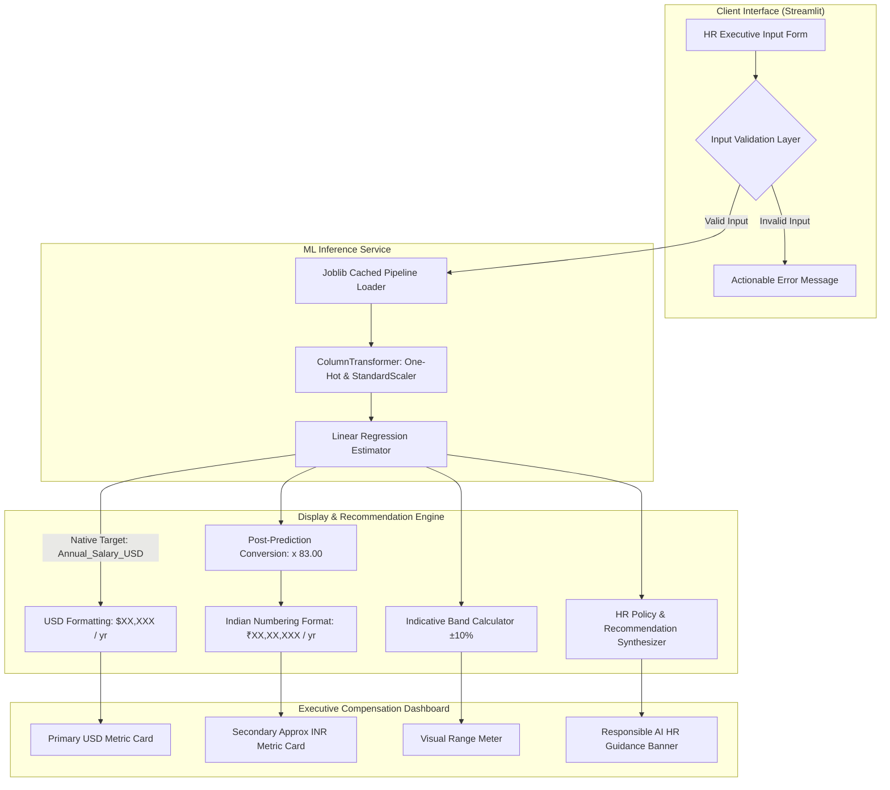

# SalarySense AI

> **Fair, data-informed salary guidance for smarter hiring.**

[](https://salarysense-ai.streamlit.app)
[](https://www.python.org/)
[](https://scikit-learn.org/)
[](LICENSE)
[](https://developers.google.com/community/gdg)
[]()

SalarySense AI is an enterprise-grade Human Resources decision-support system built for **ABC Technologies**. It empowers talent acquisition teams, compensation committees, and HR business partners to benchmark competitive, market-aligned, and equitable compensation packages using a machine-learning regression pipeline trained on 200,000 empirical employee records.

---

## Table of Contents
1. [Dual-Currency Architecture & Transparency](#dual-currency-architecture--transparency)
2. [Key Capabilities](#key-capabilities)
3. [System Architecture](#system-architecture)
4. [Machine Learning Pipeline & Evaluation](#machine-learning-pipeline--evaluation)
5. [Project Structure](#project-structure)
6. [Local Installation & Execution](#local-installation--execution)
7. [Automated Testing & Verification](#automated-testing--verification)
8. [Configuration & Maintenance](#configuration--maintenance)
9. [Responsible AI & Ethical Governance](#responsible-ai--ethical-governance)
10. [Author & Maintainer](#author--maintainer)
11. [License](#license)

---

## Dual-Currency Architecture & Transparency

> [!IMPORTANT]
> **Authoritative Currency Standard**:
> - The machine learning model was trained with the continuous target **`Annual_Salary_USD`**.
> - **USD (`$`)** is the **sole, native, and authoritative ML prediction** generated by the model pipeline.
> - **INR (`₹`)** is strictly a **post-prediction approximate display conversion** calculated using a fixed reference rate of `1 USD = ₹83.00` formatted according to the Indian numbering system (`₹X,XX,XXX`).
> - The application explicitly distinguishes native model inference from display conversion: **the model does not predict INR directly, nor does it poll live foreign-exchange markets.**

```
[Candidate Inputs] 
       │
       ▼
[Scikit-Learn Pipeline] ──► [Predicted Annual_Salary_USD] (Authoritative ML Output)
                                     │
                 ┌───────────────────┴───────────────────┐
                 ▼                                       ▼
        [Primary Display: USD]            [Secondary Display: Approx INR]
        $85,000 / year                     ₹70,55,000 / year
        (Model Output)                     (Calculated at 1 USD = ₹83.00)
```

---

## Key Capabilities

- **Enterprise OpenDesign UI**: Executive layout styled in Navy (`#0F172A`), Deep Slate (`#1E3A8A`), and Cyan (`#06B6D4`) with fully responsive two-column grid design.
- **Dynamic Experience Tiering**: Automatically derives compensation experience tiers:
  - *Fresher / Entry Level* (0–2 years)
  - *Junior Professional* (3–5 years)
  - *Mid-Level Professional* (6–9 years)
  - *Senior Professional* (10–14 years)
  - *Leadership / Expert Level* (15+ years)
- **Indicative Market Band**: Renders an indicative salary benchmark range (±10% of predicted baseline) accompanied by a custom visual range meter.
- **HR Guardrails & Non-Discriminatory Guidance**: Automatically generates objective, human-in-the-loop hiring recommendations emphasizing holistic assessment, internal equity, and geographic cost-of-living adjustments.
- **Protected Attribute Safeguard**: Collects demographic context for applicant records while rigorously excluding non-job-related attributes (e.g., `Gender`) from predictive inference.
- **Client-Side Profile Reset**: One-click form clearing with clean session state recycling.

---

## System Architecture



---

## Machine Learning Pipeline & Evaluation

The model was developed, validated, and exported through the comprehensive notebook workflow across Parts A–D on 200,000 employee records:

| Parameter | Cross-Validation (5-Fold) | Holdout Test Set (20% Evaluation) | Notes |
| :--- | :--- | :--- | :--- |
| **Model Algorithm** | Linear Regression Pipeline | Linear Regression Pipeline | Selected over Decision Tree & Random Forest for lower variance and superior generalization |
| **Coefficient of Determination ($R^2$)** | **0.8541** (± 0.0014) | **0.8522** | High explanatory power with no overfitting |
| **Mean Absolute Error (MAE)** | **$9,555.64** USD | **$9,489.61** USD | Low mean deviation on test holdout |
| **Root Mean Squared Error (RMSE)** | **$11,980.20** USD | **$11,903.90** USD | Stable residual variance |
| **Target Variable** | `Annual_Salary_USD` | `Annual_Salary_USD` | Continuous annual base compensation |
| **Feature Processing** | `OneHotEncoder` (handle_unknown='ignore') + `StandardScaler` on continuous features |

---

## Project Structure

```
SalarySense-AI/
├── .streamlit/
│   └── config.toml                    # Streamlit UI theme and server configuration
├── assets/
│   ├── logo.svg                       # SalarySense AI corporate vector logo
│   └── styles.css                     # OpenDesign executive CSS styling
├── data/
│   └── README.md                      # Dataset provenance, schema, and reproduction guide
├── models/
│   ├── model_metadata.json            # Model evaluation metrics, categories, and parameters
│   └── salary_prediction_pipeline.joblib # Serialized scikit-learn pipeline artifact (3.9 KB)
├── notebooks/
│   └── salary_prediction_analysis.ipynb # Executed Jupyter notebook (Parts A through E)
├── .gitignore                         # Comprehensive Git exclusion rules
├── app.py                             # Main Streamlit web application
├── export_model.py                    # Standalone model training & export script
├── LICENSE                            # MIT License
├── README.md                          # Production documentation
├── requirements.txt                   # Production package dependencies
└── test_app_logic.py                  # Automated test verification suite
```

---

## Local Installation & Execution

### Prerequisites
- Python 3.10 or higher
- Git 2.30 or higher

### Step 1: Clone the Repository
```bash
git clone https://github.com/unknown404-practice/SalarySense-AI.git
cd SalarySense-AI
```

### Step 2: Create and Activate a Virtual Environment
**On Windows (PowerShell):**
```powershell
python -m venv venv
.\venv\Scripts\Activate.ps1
```

**On macOS / Linux (Bash):**
```bash
python3 -m venv venv
source venv/bin/activate
```

### Step 3: Install Dependencies
```bash
pip install -r requirements.txt
```

### Step 4: Run the Streamlit Application
```bash
streamlit run app.py
```
Open your browser and navigate to `http://localhost:8501`.

---

## Automated Testing & Verification

The repository includes a standalone test suite (`test_app_logic.py`) that tests the inference pipeline, currency formatters, experience category classification, and validation rules without needing an active web server.

Run the test suite:
```bash
python test_app_logic.py
```

**Test Coverage Highlights:**
- **Pipeline Integrity**: Verifies pipeline loading from `models/salary_prediction_pipeline.joblib`.
- **Formatting Validation**: Tests Indian numbering comma placement (`₹1,22,45,119`) and USD currency formatting (`$147,532`).
- **Profile Benchmarks**:
  - *Candidate A (Entry-Level QA Engineer)*: Age 22, Exp 1 yr $\rightarrow$ predicted ~$28,794 USD (~₹23,89,914).
  - *Candidate B (Mid-Level Software Engineer)*: Age 28, Exp 5 yrs $\rightarrow$ predicted ~$59,644 USD (~₹49,50,444).
  - *Candidate C (Senior Engineering Manager)*: Age 42, Exp 18 yrs $\rightarrow$ predicted ~$147,532 USD (~₹1,22,45,119).
- **Edge-Case Validation**: Asserts rejection of biologically impossible experience constraints (e.g., Age 25 with 15 years of experience).

---

## Configuration & Maintenance

### Currency Reference Rate Modification
The conversion multiplier is maintained as a single configuration variable in `app.py`:
```python
# app.py (Lines 18-20)
USD_TO_INR_RATE = 83.00
USD_TO_INR_RATE_SOURCE = "Configured reference exchange benchmark"
USD_TO_INR_RATE_DATE = "Configured for this project demo"
```
To update the rate (for example, to `84.25`), modify `USD_TO_INR_RATE = 84.25`. The app will immediately adopt the new rate upon next reload.

### Re-training the Model
If new compensation data becomes available:
1. Place the updated dataset in the root or `data/` directory named `200000_employee_dataset.csv`.
2. Run the standalone retrainer:
   ```bash
   python export_model.py
   ```
3. The script will clean data, fit the ColumnTransformer pipeline, log holdout metrics, and update `models/salary_prediction_pipeline.joblib` and `models/model_metadata.json`.

---

## Responsible AI & Ethical Governance

SalarySense AI implements responsible AI standards for employment decision systems:
1. **Human-in-the-Loop Decision Support**: Predictions serve exclusively as baseline advisory benchmarks. Hiring managers must consider holistic factors including portfolio quality, interpersonal evaluation, unique specializations, and geographical location.
2. **Exclusion of Protected Attributes**: Gender is collected solely for candidate identity profiling and is explicitly excluded from the mathematical regression pipeline to prevent biased wage-setting.
3. **Transparent Uncertainty**: Every prediction includes an indicative $\pm 10\%$ band to communicate inherent estimation variance rather than presenting single-point definitive figures.

---

## Author & Maintainer

**Ranadeep Saha**  
- **Email:** [ranadeep2021saha@gmail.com](mailto:ranadeep2021saha@gmail.com)  
- **GitHub:** [@unknown404-practice](https://github.com/unknown404-practice)  
- **LinkedIn:** [Ranadeep Saha](https://www.linkedin.com/in/ranadeep-saha-a03296404/)  
- **Community:** Member of **Google Developer Group**

---

## License

This project is licensed under the [MIT License](LICENSE) — see the LICENSE file for details.

© 2026 Ranadeep Saha. All rights reserved.
